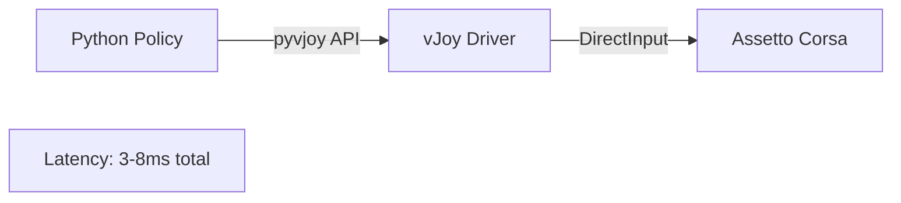

# Control System Documentation

## Overview

The control system enables sending commands to Assetto Corsa via vJoy (virtual joystick). This provides low-latency control for reinforcement learning training and automated driving.

## Architecture



**Components**:
- **VJoyController**: Python class for sending control commands
- **vJoy Driver**: Kernel-mode virtual joystick driver (Windows)
- **DirectInput**: Standard Windows game input API

**Latency**:
- Python → vJoy: 1-2ms
- vJoy → AC: 2-5ms
- Total: 3-8ms (comparable to physical wheel)

## Installation

### 1. Install vJoy Driver

Download and install vJoy from:
https://sourceforge.net/projects/vjoystick/

Run the installer with default settings.

### 2. Configure vJoy Device

Open "Configure vJoy" application:

**Device 1 Settings**:
- Enable: ✓
- Axes:
  - X Axis: ✓ (Steering)
  - Y Axis: ✓ (Throttle)
  - Z Axis: ✓ (Brake)
  - RZ Rotation: ✓ (Clutch)
- Buttons: 12 or more (recommended)
- POV Hat Switch: 0 (disabled)

Click "Apply" to save configuration.

### 3. Install Python Dependencies

The `pyvjoy` library is included in project dependencies:

```bash
uv sync
```

### 4. Configure Assetto Corsa

In AC, go to Options → Controls:

1. Select "vJoy Device" as controller
2. Map axes:
   - Steering: X Axis
   - Throttle: Y Axis
   - Brake: Z Axis
   - Clutch: RZ Axis
3. Set all axis ranges:
   - Minimum: -100%
   - Maximum: +100%
   - Deadzone: 0%
   - Gamma: 1.0

### 5. Button Mappings

Map vJoy buttons in AC for full functionality:

| vJoy Button | Recommended Mapping | Required for AC Bridge |
|-------------|---------------------|------------------------|
| Button 1 | Next gear | No (optional) |
| Button 2 | Previous gear | No (optional) |
| Button 3 | Brake balance → front | No (optional) |
| Button 4 | Brake balance → rear | No (optional) |
| Button 5 | Traction control + | No (optional) |
| Button 6 | Traction control - | No (optional) |
| **Button 7** | **Restart race** | **Yes** ⚠️ |
| Button 8 | Restart session | No |
| **Button 9** | **Start race** | **Yes** ⚠️ |
| Button 10-12 | (Unassigned) | No |

!!! warning "Required for Reset"
    **Buttons 7 and 9 are required** for `ACBridgeLocal.reset()` to work properly:
    
    - Button 7 triggers the race restart
    - Button 9 starts the race after restart
    
    The reset sequence: Press button 7 → Wait 2s → Press button 9 → Reset controls → Shift to 1st gear

!!! tip "Interactive Button Testing"
    Use the interactive test tool to verify button mappings:
    ```bash
    uv run examples/test_control.py
    # Press 'b1' through 'b12' to test each button
    ```

## Usage

### Quick Test

Verify vJoy installation:

```bash
uv run main.py test-control
```

Use keyboard controls (W/A/S/D) to test throttle, brake, and steering.

### Python API

```python
from ac_bridge.control import VJoyController

# Initialize controller
controller = VJoyController(device_id=1)

# Set individual controls
controller.set_throttle(0.8)    # 80% throttle
controller.set_brake(0.0)       # No brake
controller.set_steering(-0.5)   # Half left
controller.set_clutch(0.0)      # Clutch released

# Batch update (most efficient)
controller.set_controls(
    throttle=0.8,
    brake=0.0,
    steering=-0.5,
    clutch=0.0
)

# Gear shifting
controller.set_gear(3)  # 2nd gear (0=R, 1=N, 2=1st, 3=2nd, ...)

# Reset to neutral
controller.reset()

# Clean up
controller.close()
```

### Value Ranges

| Control | Range | Notes |
|---------|-------|-------|
| Throttle | 0.0 - 1.0 | 0=off, 1=full |
| Brake | 0.0 - 1.0 | 0=off, 1=full |
| Clutch | 0.0 - 1.0 | 0=released, 1=pressed |
| Steering | -1.0 - 1.0 | -1=full left, 0=center, 1=full right |
| Gear | 0-7 | 0=R, 1=N, 2=1st, 3=2nd, etc. |

### Closed-Loop Example

```python
from ac_bridge.telemetry.ac_native_memory import ACSharedMemory
from ac_bridge.control import VJoyController
import time

asm = ACSharedMemory()
controller = VJoyController()

while True:
    # Read telemetry
    p = asm.physics
    speed = p.speedKmh
    
    # Simple speed control
    target_speed = 100.0
    error = target_speed - speed
    throttle = max(0.0, min(1.0, error * 0.01))
    
    # Apply control
    controller.set_throttle(throttle)
    
    time.sleep(0.02)  # 50 Hz
```

### Cloud Training Integration

**On Windows (home PC)**:
```bash
# Receive controls from cloud
uv run main.py control-from-cloud --uri ws://your-ec2:8766
```

**On Cloud (EC2)**:
```python
import asyncio
import json
import websockets

async def send_controls():
    async with websockets.connect("ws://windows-pc:8766") as ws:
        # Send control command
        controls = {
            "throttle": 0.8,
            "brake": 0.0,
            "steering": -0.2,
            "clutch": 0.0
        }
        await ws.send(json.dumps(controls))

asyncio.run(send_controls())
```

## Performance Optimization

### Value Caching

The `VJoyController` caches values and only sends updates when values change:

```python
# Only sends one vJoy command (value unchanged)
controller.set_throttle(0.5)
controller.set_throttle(0.5)  # Skipped (cached)
controller.set_throttle(0.6)  # Sent (changed)
```

### Batch Updates

Use `set_controls()` for multiple axes to minimize API calls:

```python
# Efficient: Single update
controller.set_controls(throttle=0.8, brake=0.0, steering=-0.3)

# Less efficient: Multiple updates
controller.set_throttle(0.8)
controller.set_brake(0.0)
controller.set_steering(-0.3)
```

### Update Rate

Target 50-100 Hz for smooth control:

```python
rate_hz = 60
sleep_time = 1.0 / rate_hz

while running:
    controller.set_controls(...)
    time.sleep(sleep_time)
```

Higher rates (>100 Hz) provide diminishing returns due to AC's internal polling rate.

## Troubleshooting

### Error: Failed to initialize vJoy device

**Cause**: vJoy driver not installed or device not configured

**Solution**:
1. Install vJoy from https://sourceforge.net/projects/vjoystick/
2. Open "Configure vJoy" and enable device 1
3. Verify 4 axes are enabled (X, Y, Z, RZ)
4. Click "Apply"

### Controls not responding in AC

**Cause**: AC not configured for vJoy

**Solution**:
1. In AC: Options → Controls → Controller
2. Select "vJoy Device"
3. Map throttle, brake, steering, clutch
4. Remove deadzones (set to 0%)
5. Test controls in AC before using Python

### High latency / jerky control

**Cause**: Update rate too low or system overload

**Solution**:
1. Increase control update rate (60-100 Hz)
2. Use `set_controls()` instead of individual axis updates
3. Reduce telemetry polling rate if CPU-bound
4. Close background applications

### vJoy device busy / in use

**Cause**: Another application using vJoy device 1

**Solution**:
1. Close other apps using vJoy
2. Or use different device ID: `VJoyController(device_id=2)`
3. Configure device 2 in "Configure vJoy" first

### Steering/throttle stuck at max

**Cause**: Axis range misconfigured in AC

**Solution**:
1. AC Options → Controls → Axes
2. Set minimum to -100%, maximum to +100%
3. Verify in calibration screen
4. Reset controller: `controller.reset()`

## Advanced Usage

### Custom Gear Mapping

Override gear shifting behavior:

```python
class CustomGearController(VJoyController):
    def set_gear(self, gear: int):
        # Custom H-pattern mapping using buttons 1-7
        for i in range(1, 8):
            self.device.set_button(i, 1 if i == gear else 0)
```

### Multi-Device Setup

Control multiple vJoy devices:

```python
# Primary controls
controller1 = VJoyController(device_id=1)
controller1.set_controls(throttle=0.8, brake=0.0, steering=0.0)

# Secondary inputs (e.g., handbrake, DRS)
controller2 = VJoyController(device_id=2)
controller2.device.set_button(1, 1)  # Handbrake
```

### Performance Monitoring

Track control performance:

```python
stats = controller.get_stats()
print(f"Updates: {stats['updates']}")
print(f"Rate: {stats['update_rate_hz']:.1f} Hz")
print(f"Duration: {stats['elapsed_seconds']:.1f}s")
```

## Integration with RL Training

### Observation-Action Loop

```python
import gymnasium as gym
from ac_bridge.telemetry.ac_native_memory import ACSharedMemory
from ac_bridge.control import VJoyController

class ACEnv(gym.Env):
    def __init__(self):
        self.telemetry = ACSharedMemory()
        self.controller = VJoyController()
    
    def reset(self):
        self.controller.reset()
        return self._get_obs()
    
    def step(self, action):
        # Apply action
        self.controller.set_controls(
            throttle=action[0],
            brake=action[1],
            steering=action[2]
        )
        
        # Wait for physics update
        time.sleep(0.016)  # 60 Hz
        
        # Get new observation
        obs = self._get_obs()
        reward = self._compute_reward()
        done = self._check_termination()
        
        return obs, reward, done, {}
    
    def _get_obs(self):
        p = self.telemetry.physics
        return [
            p.speedKmh / 300.0,
            p.steerAngle / 900.0,
            p.heading,
            # ... more features
        ]
```

### Cloud Training Setup

See [Cloud Setup](../advanced/cloud-setup.md) for bidirectional telemetry + control over WebSocket.

## Technical Details

### vJoy Axis Mapping

| vJoy Axis | Usage ID | AC Control | Range |
|-----------|----------|------------|-------|
| X | HID_USAGE_X | Steering | 0x1 - 0x8000 |
| Y | HID_USAGE_Y | Throttle | 0x1 - 0x8000 |
| Z | HID_USAGE_Z | Brake | 0x1 - 0x8000 |
| RZ | HID_USAGE_RZ | Clutch | 0x1 - 0x8000 |

Internal conversion:
- Float 0.0 → vJoy 0x1 (min)
- Float 0.5 → vJoy 0x4000 (center)
- Float 1.0 → vJoy 0x8000 (max)

### Button Usage

Buttons 1-8 can be mapped in AC for:
- Gear up/down (sequential)
- H-pattern gears (individual buttons)
- DRS, KERS activation
- Look left/right
- Pit limiter

### Latency Measurement

Test round-trip latency:

```python
import time

controller = VJoyController()
asm = ACSharedMemory()

# Measure control → telemetry latency
start = time.perf_counter()
controller.set_throttle(1.0)

while asm.physics.gas < 0.9:
    time.sleep(0.001)

latency_ms = (time.perf_counter() - start) * 1000
print(f"Control latency: {latency_ms:.1f}ms")
```

Typical results: 5-15ms (includes AC's input polling + physics update).

## References

- vJoy Project: https://sourceforge.net/projects/vjoystick/
- pyvjoy Library: https://github.com/tidzo/pyvjoy
- Windows DirectInput API: https://docs.microsoft.com/en-us/windows/win32/directinput/

